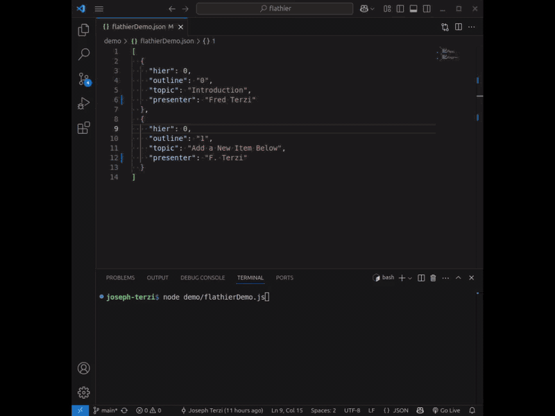

# flathier

[](https://www.npmjs.com/package/flathier)

[](https://github.com/fred-terzi/flathier/blob/main/LICENSE)

FlatHier is a technical foundation for managing hierarchical data in a flat, ordered JSON format. FlatHier enables all hierarchical operations—such as add, delete, move, promote, demote, and outline computation—while maintaining a single, human-readable ordered structure.

 ### Demo Video

 

**Technical Highlights:**
- Flat, ordered JSON structure for efficient diffing and git integration
- Deterministic outline and hierarchy computation for robust data integrity
- Designed for seamless automation and programmatic manipulation
- Enables granular tracking and editing of requirements, features, and project metadata
- Optimized for both manual and automated workflows in modern development environments

Use FlatHier to ensure your project's hierarchical data remains consistent, auditable, and ready for both human and machine consumption.

## Installation

To install FlatHier, run:

```bash
npm install flathier
```

After installation, you can import FlatHier modules in your project. See the README for more details and usage examples.

## Core Functions

FlatHier's core functions provide all the essential operations needed to manage a flat, ordered hierarchy of items. These include adding, deleting, moving, promoting, demoting, and visualizing items. Each function is modular, well-documented, and thoroughly tested, ensuring robust and predictable behavior for all hierarchy management tasks.

### addObject(): Insert new object after outline number

The addObject.js module provides a function to insert a new item into a flat hierarchical data array, assign a unique ID, and update outlines. It ensures data integrity and proper error handling.

**Example Usage:**

```js
import flathier from 'flathier';

const data = [
  { outline: '0', title: 'Root', hier: 0 },
  { outline: '1', title: 'First Item', hier: 1 },
  { outline: '1.1', title: 'Child', hier: 1 },
  { outline: '2', title: 'Sibling', hier: 0 },
  { outline: '2.1', title: 'Another Child', hier: 1 }
  // ... more items
];

const newItem = { title: 'New Sibling'};

(async () => {
  const updated = await flathier.addObject(data, '1', newItem);
  // updated now contains the new item after outline '1', with a unique reqt_ID and correct outlines
})();
```

- Note: `addObject` is accessed as a property of the main `flathier` package export. It is asynchronous and returns a Promise.
- If not already present `hier`, `outline`, or `reqt_ID` fields, they will be added to the new item.

### asciiTree(): Render flat hierarchy as ASCII-art tree

The `asciiTree()` function visualizes a flat hierarchy as an ASCII-art tree, making it easy to inspect structure and relationships. It takes an array of items (each with at least 'outline' and 'title' fields) and an array of additional fields to include in the output. The function sorts items, builds parent-child relationships, and treats the first top-level item as the main root, attaching any additional top-level nodes as children. The output is an array of strings, each representing a row of the ASCII tree, with proper connectors and indentation.

**Example Usage:**

```js
import flathier from 'flathier';

const items = [
  { outline: '1', title: 'Root' },
  { outline: '1.1', title: 'Child A' },
  { outline: '1.2', title: 'Child B' },
  { outline: '2', title: 'Another Root' }
];

const treeRows = await flathier.asciiTree(items, ['title']);
treeRows.forEach(row => process.stdout.write(row));
// Output:
// └── 1: Root
//     ├── 1.1: Child A
//     └── 1.2: Child B
//     └── 2: Another Root
```

- Note: The function is asynchronous and returns an array of strings (one per row, each ending with a newline character).
- You can specify which fields to include in each node's label by passing an array of field names as the second argument.
- Multiple top-level nodes are attached to the first as children for a single-rooted display.

### deleteObject(): Delete item by outline and update hierarchy

The `deleteObject()` function removes an item from a flat hierarchical data array by outline number and updates outlines for the remaining items, ensuring data integrity. If the outline number is invalid, no changes are made and an error is logged.

**Example Usage:**

```js
import flathier from 'flathier';

const data = [
  { outline: '0', title: 'Root', hier: 0 },
  { outline: '1', title: 'First Item', hier: 1 },
  { outline: '1.1', title: 'Child', hier: 1 },
  { outline: '2', title: 'Sibling', hier: 0 }
];

const updated = flathier.deleteObject(data, '1.1');
// updated now contains the array with the item '1.1' removed and outlines recomputed
```

- Note: `deleteObject` is synchronous and returns the updated array, or the original array if the outline number is invalid.

### demote(): Demote node and subtree one level

The `demote()` function demotes a node (and its subtree) one level deeper in the hierarchy, making it the last child of its immediate previous sibling. It returns a new array with updated hierarchy and outlines. If the selection is invalid or the first item is selected, the original array is returned unchanged.

**Example Usage:**

```js
import flathier from 'flathier';

const data = [
  { outline: '1', title: 'Root' },
  { outline: '1.1', title: 'Child A' },
  { outline: '1.2', title: 'Child B' }
];

const updated = flathier.demote(data, '1.2');
// '1.2' is now a child of '1.1', outlines and hierarchy are updated
```

- Note: `demote` is synchronous and returns the updated array, or the original array if the operation is invalid.

### moveDown(): Move node and subtree down among siblings

The `moveDown()` function moves a node (and its subtree) down one position among its siblings in the hierarchy, updating the order and outlines. If the node is already last or the selection is invalid, the original array is returned unchanged.

**Example Usage:**

```js
import flathier from 'flathier';

const data = [
  { outline: '1', title: 'Root' },
  { outline: '1.1', title: 'Child A' },
  { outline: '1.2', title: 'Child B' }
];

const updated = flathier.moveDown(data, '1.1');
// '1.1' and its subtree are now after '1.2', outlines are updated
```

- Note: `moveDown` is synchronous and returns the updated array, or the original array if the operation is invalid.

### moveUp(): Move node and subtree up among siblings

The `moveUp()` function moves a node (and its subtree) up one position among its siblings in the hierarchy, updating the order and outlines. If the node is already first or the selection is invalid, the original array is returned unchanged.

**Example Usage:**

```js
import flathier from 'flathier';

const data = [
  { outline: '1', title: 'Root' },
  { outline: '1.1', title: 'Child A' },
  { outline: '1.2', title: 'Child B' }
];

const updated = flathier.moveUp(data, '1.2');
// '1.2' and its subtree are now before '1.1', outlines are updated
```

- Note: `moveUp` is synchronous and returns the updated array, or the original array if the operation is invalid.

### promote(): Promote node and subtree one level up

The `promote()` function promotes a node (and its subtree) one level up in the hierarchy, making it a sibling of its parent. It returns a new array with updated hierarchy and outlines. If the selection is invalid or the node is already top-level, the original array is returned unchanged.

**Example Usage:**

```js
import flathier from 'flathier';

const data = [
  { outline: '1', title: 'Root' },
  { outline: '1.1', title: 'Child A' },
  { outline: '1.1.1', title: 'Grandchild' }
];

const updated = flathier.promote(data, '1.1.1');
// '1.1.1' is now a sibling of '1.1', outlines and hierarchy are updated
```

- Note: `promote` is synchronous and returns the updated array, or the original array if the operation is invalid.

## Utilities

FlatHier provides a set of utility functions to support core hierarchy operations. These utilities enable advanced manipulation, transformation, and validation of flat and nested hierarchical data. They are designed for internal use by core functions, but can also be used directly for custom workflows and integrations.

**Included Utilities:**
- `buildTree()`: Converts a flat array with outline/hier fields into a nested tree structure.
- `computeOutlines()`: Recomputes outline numbers for all items in a flat hierarchy after changes.
- `editTitle()`: Updates the title of an item by outline number.
- `flattenTree()`: Flattens a nested tree structure back into a flat array with correct outline/hier fields.
- `generateUniqueId()`: Generates unique, timestamp-based IDs for use in item fields (e.g., *_ID).

**Usage Example:**

```js
import flathier from 'flathier';

const flat = [
  { outline: '1', title: 'Root', hier: 0 },
  { outline: '1.1', title: 'Child', hier: 1 }
];

const tree = flathier.buildTree(flat);
const flatAgain = flathier.flattenTree(tree);
const updated = flathier.editTitle(flatAgain, '1.1', 'New Title');
const outlines = flathier.computeOutlines(updated);
const id = flathier.generateUniqueId();
```

- These utilities are synchronous unless otherwise noted.
- They are accessible as properties of the main `flathier` package export.
- See individual function documentation for details and advanced usage.

### buildTree(): Build nested tree from flat array

The buildTree.js utility provides a function to convert a flat hierarchy into a nested tree, enabling hierarchical operations and visualizations.

### computeOutlines(): Recompute outline numbers for all items

The computeOutlines.js utility ensures that all items in a flat hierarchy have correct outline numbers after any structural modification.

### editTitle(): Edit the title of an item by outline

The editTitle.js utility provides a function to update the title of an item in a flat hierarchy by outline number.

### flattenTree(): Flatten nested tree to flat array

The flattenTree.js utility provides a function to flatten a nested tree structure into a flat array for storage or further processing.

### generateUniqueId(): Generate unique IDs for items

The generateUniqueId.js utility provides a function to generate unique, timestamp-based IDs for use in hierarchical data structures.

---
Generated by **ReqText v0.1.0-demo.22** on 2025-05-25T13:40:18.753Z

[ReqText Github Repo](https://github.com/fred-terzi/reqtext)
