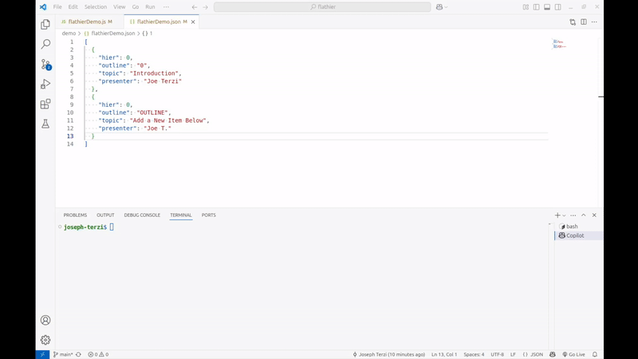

# FlatHier

FlatHier is a lightweight Node.js library designed to create and manipulate hierarchical data stored in a flat JSON structure. It provides a set of core, data handling, and utility functions to manage hierarchical data efficiently.

## Features

- **Core Functions**: Create, add, delete, promote, demote, and move hierarchical objects.
- **Utility Functions**: Generate ASCII tree representations, compute outlines, generate unique IDs, and more.

## Demo Script
A demo script is included in the `demo` directory. It showcases the library's capabilities and ascii tree generation. 



## Installation

Install the library using npm:

```bash
npm install flathier
```

## API Reference

### Core Functions
- `addObject(data, outlineNumber)`: Add an object to the hierarchy under the specified outline number.
- `deleteObject(data, outlineNumber)`: Delete an object by its outlineNumber.
- `promote(data, outlineNumber)`: Promote an object and its children in the hierarchy.
- `demote(data, outlineNumber)`: Demote an object and its children in the hierarchy.
- `moveUp(data, outlineNumber)`: Move an object and its children up in the hierarchy.
- `moveDown(data, outlineNumber)`: Move an object and its children down in the hierarchy.
- `createAsciiTree(data, fieldsToInclude)`: Generate an ASCII representation of the hierarchy given the data and the fields from the object to include in the tree title.
  
  Example:
  ```javascript
  const asciiTree = flathier.createAsciiTree(data, ['title', 'status']);
  console.log(asciiTree);
  ```

### Utility Functions
- `getLastItemOutline()`: Get the outline of the last item in the hierarchy.
- `getLastTemplateObject()`: Get the template object for the last item in the hierarchy.

## Contributing

Contributions are welcome! Please fork the repository and submit a pull request.

## License

This project is licensed under the AGPL-3.0 License. See the [LICENSE](LICENSE) file for details.

