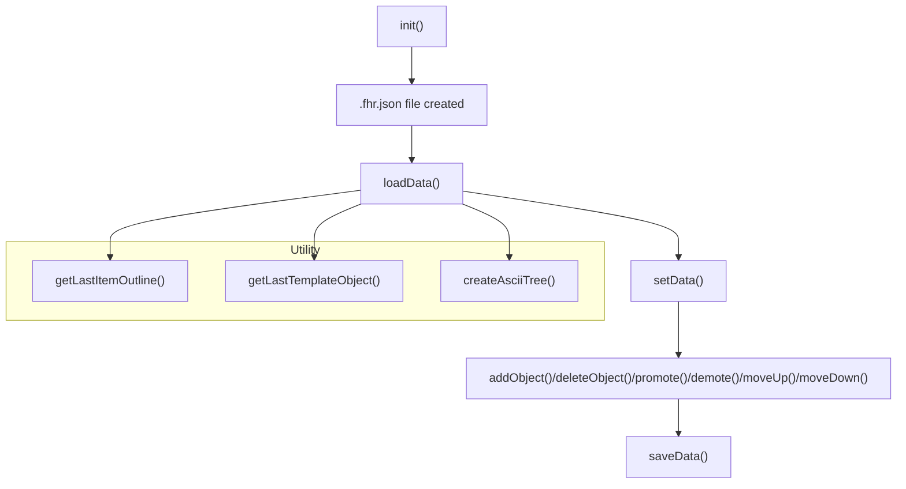
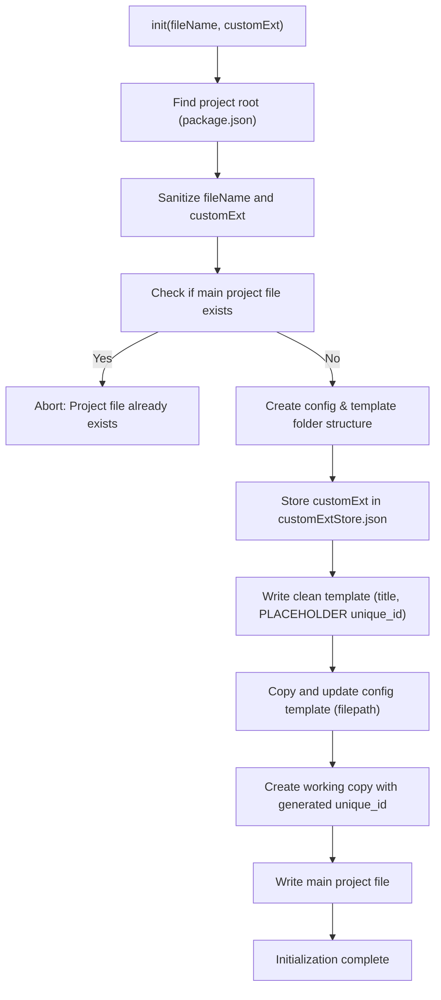
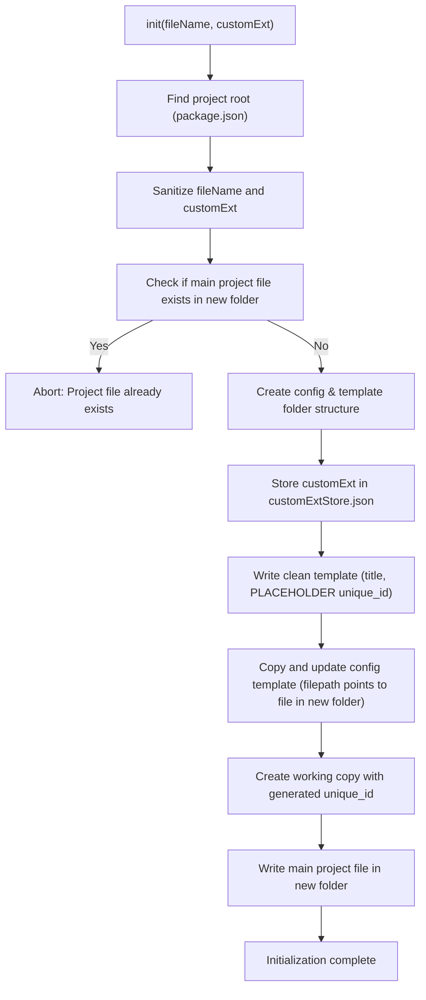
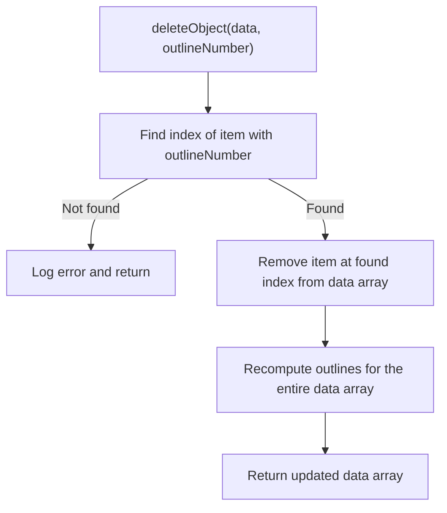

## Flow Diagram of the Library

Below is a high-level flow diagram of how the main functions in the flathier library interact:

## Flow Diagram of the init function

version: 0.1.0-demo.8

version: 0.1.0-demo.9 proposed changes

This diagram shows the step-by-step logic of the `init` function, including handling of custom extensions, template/config creation, and unique ID generation.

## deleteObject function

### Flow Diagram

